class: center, middle
.header[]

# Tests de charge SvelteKit / Pyramid

Bruno Thomas - Iroco.co - @bthomas@mastodon.social
---
class: middle,center
.header[]

# [Iroco](https://iroco.co)

* fournisseur de mail
* calendrier en ligne
* contacts en ligne

*[OpenSource](https://github.com/iroco-co) et Eco-"étudié"*
*Quelle IT dans un monde à 1,5°C en 2050 ?*
---
class: middle
.header[]

# Historique & Contexte

1. Existant python/js (endetté pour js)
2. [Tests backend](https://blog.iroco.co/tir-laptop/) rust/python
3. [Tests frontend](https://blog.iroco.co/frontend-benchmark/) svelte/react/vue
4. Migration front vers svelte
5. [Sortie de sveltekit](https://svelte.dev/blog/announcing-sveltekit-1.0)
6. Retours de bonne tenue en charge de nodejs

---
class: center, middle
.header[]

.spacer[]

<a href="https://dl.acm.org/doi/10.1145/3136014.3136031">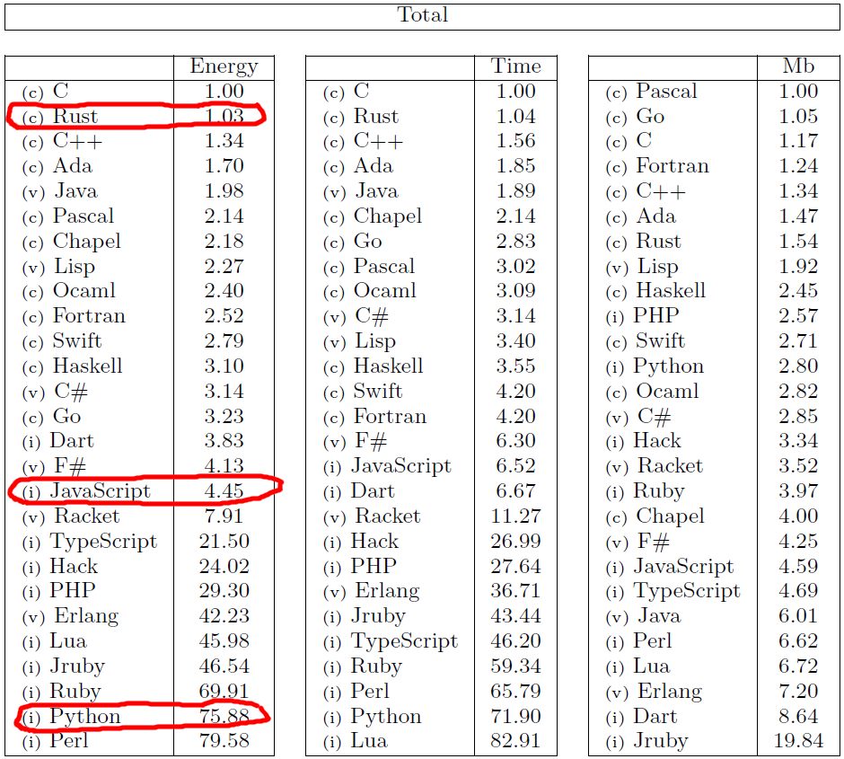</a>
---
class: middle
.header[]

## Svelte ? Sveltekit ? Pyramid ?

* [Pyramid](https://trypyramid.com/) : framework web python backend (s'éxécute sur le serveur)
* [Svelte](https://svelte.dev/) : framework web frontend (s'éxécute dans le navigateur)
* [SvelteKit](https://kit.svelte.dev/) : méta-framework web (fullstack : s'exécute dans les deux)
---
class: middle
.header[]

## Pourquoi Svelte/Sveltekit ?
  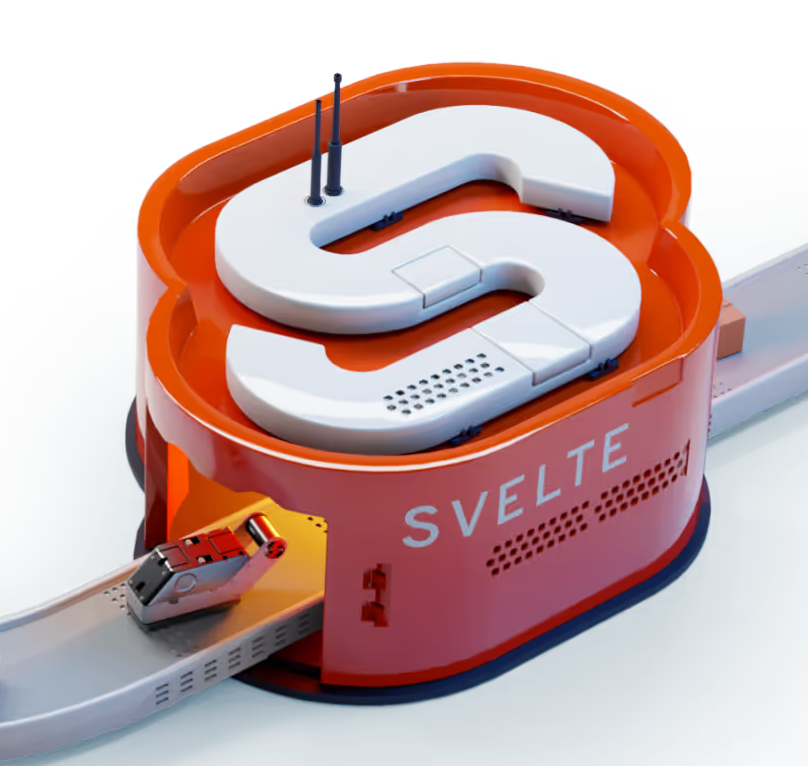
  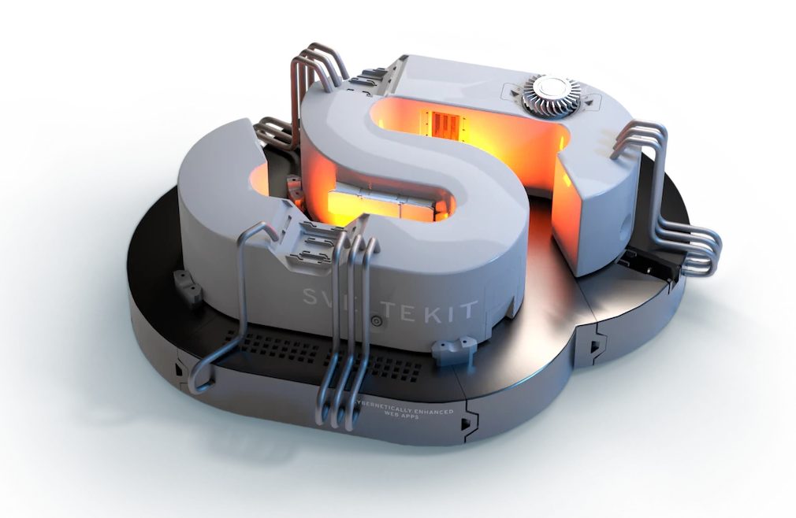

* Créé par Rich Harris depuis 2016
* Objectif : revenir au web (HTML, javascript, CSS) et écrire moins de code
* S'utilise au build : génère du HTML/javascript/CSS qui est déployé sur le serveur
* Pas de DOM virtuel
* Sveltekit : usine logicielle + serveur d'application basé sur la structure de fichiers sur disque. Permet de "migrer" ou mutualiser du code client/serveur
* Javascript/Typescript : expertise plus courante chez les développeurs que Rust
---
class: middle
.header[]

## Les promesses

* Prefetch
* Server Side Rendering
* Reactive
* Code-splitting
* Minification
* Compatible pur HTML (sans javascript)
* Composants web modernes
* Build et runtime rapide (vite, vitest...)
---
class: center, middle
.header[]

# Scope 2

---
class: center, middle
.header[]

## Tests de charge serveur

---
class: center, middle
.header[]

### Scenario 1 : login

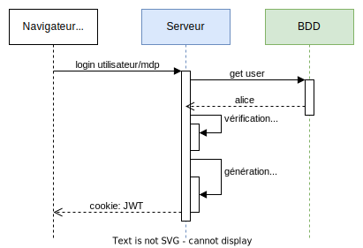
---
class: middle
.header[]

### Résultats : login

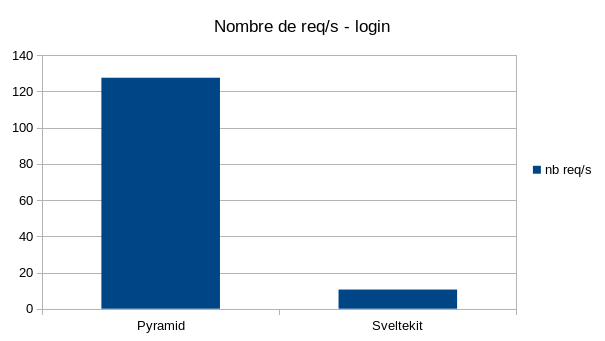
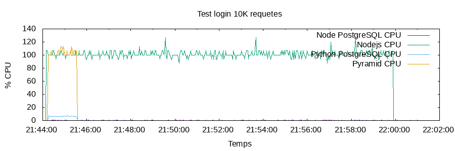

---
class: center,middle
.header[]

### Scenario 2 : GET utilisateur BDD

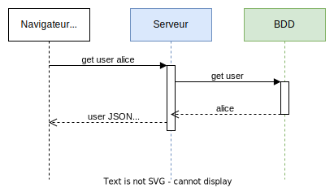

---
class: middle
.header[]

### Résultats : utilisateur BDD

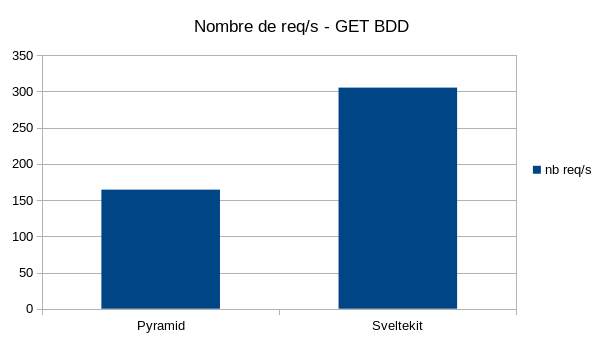
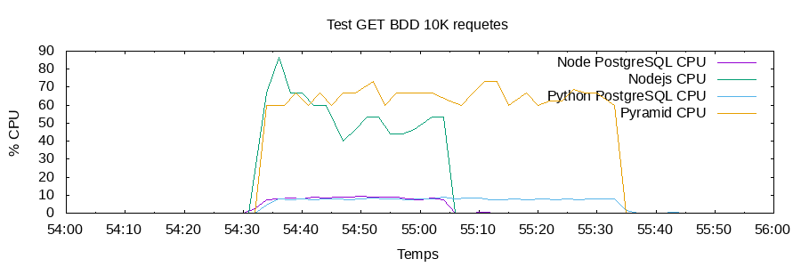

---
class: middle
.header[]

### Résultats : utilisateur BDD 8 clients

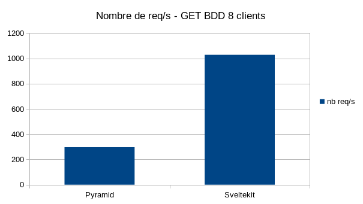
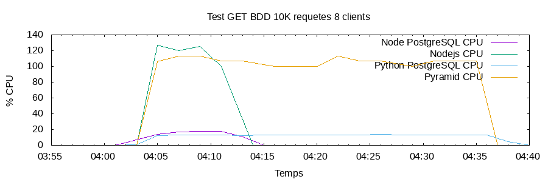

---
class: middle
.header[]

> *À petites causes, grands effets :*

<blockquote class="twitter-tweet" data-theme="dark">
How can `a+b` be almost 4x faster than `b+a`?  🤯  1/6 <a href="https://t.co/UYAGQJYLmL">pic.twitter.com/UYAGQJYLmL</a>
&mdash; Miško Hevery (Builder.io/Qwik) (@mhevery) <a href="https://twitter.com/mhevery/status/1635492705315999744?ref_src=twsrc%5Etfw">March 14, 2023</a></blockquote>  
---
class: center, middle
.header[]

## Tests de charge client (navigateur)
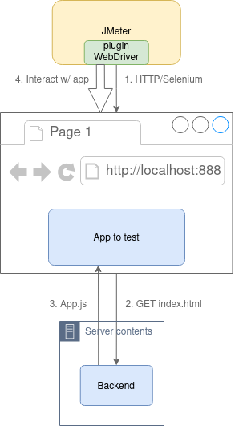

---
class: middle
.header[]

### Scénario : login et navigation
* Login utilisateur
* Navigation (100 fois)
  * clic sur "Aliases"
  * clic sur "Mon compte"
* Logout

Avec 4 utilisateurs concurrents
---
class: middle
.header[]

### Résultats : test client

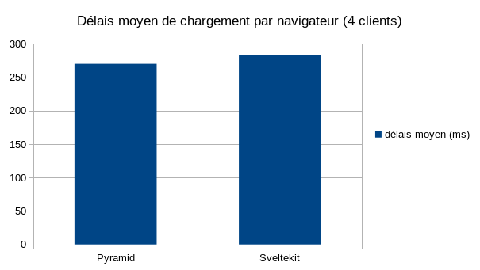
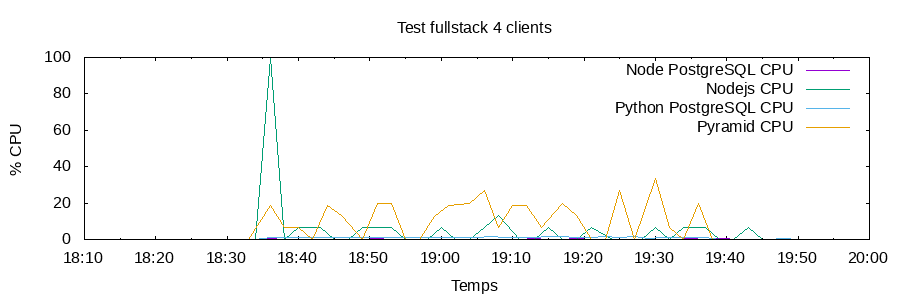

---
class: middle,center
.header[]

# Scope 3

*Obsolescence programmée*
---
class: middle,center
.header[]

## Test galaxy tab 10.1 P7510

* Mise sur le marché en 2011
* Android 3.1 "Honeycomb"
* Dual-core 1.0 GHz Cortex-A9

---
class: middle,center
.header[]

## Test KO

* Impossible d'utiliser HTTPS (version TLS 1.0 trop ancienne)
* Impossible de la mettre à jour avec la procédure "grand public"
* Mise à jour avec [Android AOSP](https://source.android.com/) version 7 "Nougat" (2016)

---
class: middle,center
.header[]

## Test OK

<iframe src="https://player.vimeo.com/video/808863331?h=bc33cba824&amp;badge=0&amp;autopause=0&amp;player_id=0&amp;app_id=58479" width="600" height="300" frameborder="0" allow="autoplay; fullscreen; picture-in-picture" allowfullscreen title="iroco-galaxytab"></iframe>

Merci l'Open Source
---
class: middle
.header[]

## Comment quantifier ?

1. Faire un recensement de tous les mobiles/tablettes android
2. Identifier la part de ceux qui sont conservés à partir de la version "Nougat" (v.s. dernière version fonctionnelle)
3. Estimer ou trouver le nombre d'équipements qui "pourraient" être conservés

---
class: middle
.header[]

# Conséquences 

* le design applicatif évolue : 
  * au début du web : formulaires POST
  * puis REST API (requêtes ajax)
  * retour aux sources
* l'[architecture hexagonale](https://alistair.cockburn.us/hexagonal-architecture/) pour implémenter des API REST avec SvelteKit
* simplicité: bonheur d'avoir un seul repository et un packaging unique
---
class: middle
.header[]

# Conclusion

* Effet de surprise lors de tests de charge
* Scope 2 mineur pour le ratio client/serveur
  * mais des conséquences étonnantes sur le run même sur une ligne de code
  * tests de charge en continu ?
* Scope 3 permet de revenir aux protocoles standards
* Lutte contre l'obsolescence difficile à quantifier

---
class: middle
.header[]

# Liens et références

* présentation réalisée avec [remark](https://remarkjs.com)
* https://jmeter.apache.org/
* https://www.selenium.dev/
* https://blog.iroco.co/
* étude sur les langages [Energy efficiency across programming languages: how do energy, time, and memory relate?](https://dl.acm.org/doi/10.1145/3136014.3136031)
